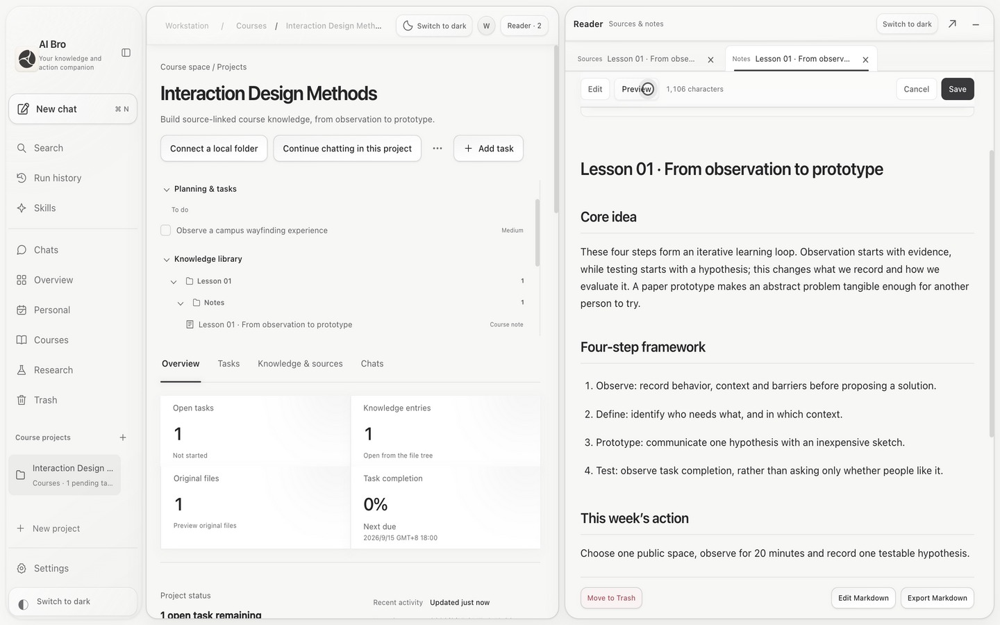
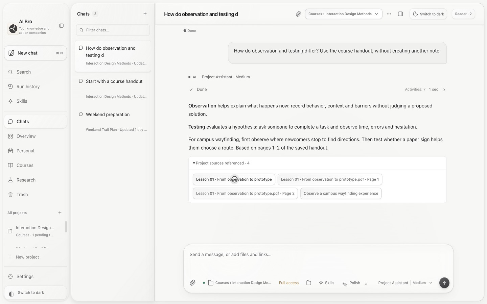
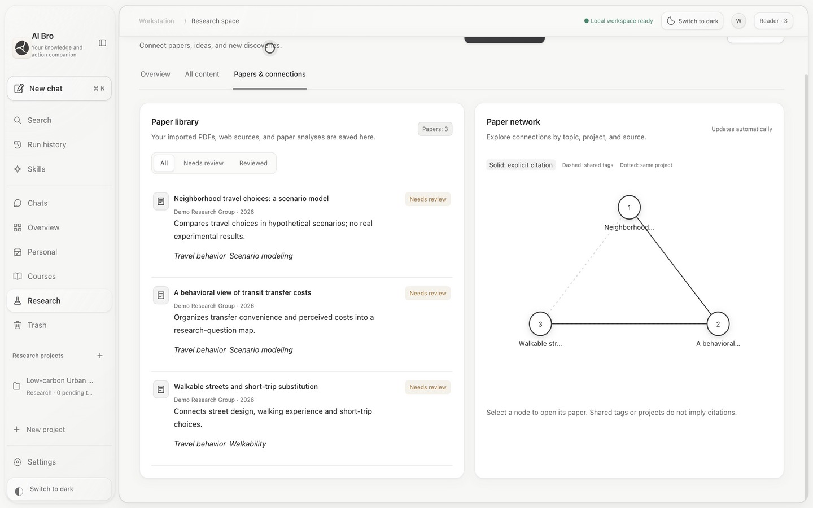
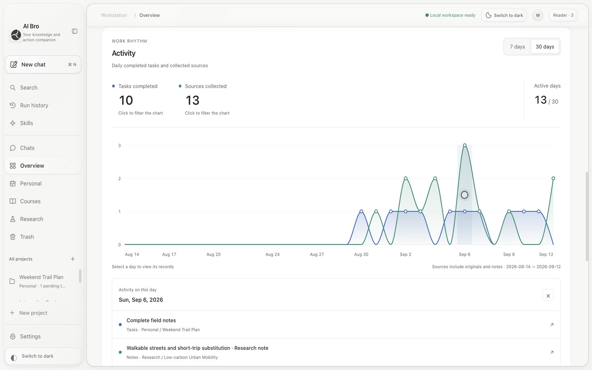

<p align="center"></p>
<h1 align="center">AI Bro</h1>
<p align="center"><strong>Your companion for knowledge and action</strong></p>
<p align="center">Conversations, source material, your understanding, and next steps—in one workspace.</p>
<p align="center"><a href="README.md">简体中文</a> · English</p>
<p align="center"><a href="https://github.com/zihenghe04/AIBro/releases">Get the Mac app</a> · <a href="https://zihenghe04.github.io/AIBro/?lang=en">Product & film</a> · <a href="#quick-start">Quick start</a> · <a href="CONTRIBUTING.md">Contribute</a></p>



Work can continue after AI finishes reading a handout or paper. AI Bro keeps originals, editable Markdown notes, tasks, and projects connected. Start another conversation to retrieve saved knowledge and return to its sources.

**AI Bro is a macOS developer preview.** Release packages support Apple Silicon and macOS 12+. They are ad-hoc signed, without Apple Developer ID signing, notarization, or automatic updates. The project license is still being decided; no particular open-source license is claimed.

[Watch the English product film](https://zihenghe04.github.io/AIBro/assets/film-en.mp4) · [观看中文短片](https://zihenghe04.github.io/AIBro/assets/film-zh.mp4)

Screenshots and films use isolated example workspaces, with no personal data. Films show real app interactions and saves with scripted model responses, edited for presentation.

> The first public App Release is being prepared. Source builds are available now; binary availability will be updated here.


## From a source to your next step

> Organize this handout in its course project. Keep the original, create a main note, and suggest useful study tasks.

1. **Ask AI:** drop in files or paste a link, describe the work, and follow reading and execution progress.
2. **Inspect the result:** open the linked project, original, note, or task to check content and ownership.
3. **Make it yours:** read the original beside your note, edit Markdown, and save your own understanding.
4. **Keep going:** retrieve the material in a new chat, or update an existing task with a follow-up deadline.

Files dropped directly into a project are initially marked as awaiting AI analysis. Storage, renaming, and text indexing do not count as analysis. AI changes to manually edited notes are kept as drafts for review.

## What you can do

| Capability | How it helps |
| --- | --- |
| **Conversations and intake** | Send files with your instructions; organize by content and context, with confirmation when course ownership is unclear. |
| **Persistent knowledge** | Keep originals, notes, tasks, and sources connected; retrieve project knowledge across conversations. |
| **Editable main notes** | Use reading tabs, PDF page navigation, Markdown editing and export; merge related notes while retaining human edits and revision history. |
| **Papers and research** | Save structured analyses; deduplicate and update by DOI, arXiv, or URL; distinguish explicit citations, shared tags, and project relationships. |
| **Tasks and progress** | Create, update, complete, and move tasks, dates, and checklists; explore 7/30-day D3 trends and open the records behind a day. |
| **Models and Skills** | Use local official Codex sign-in or a compatible API; choose models and reasoning per chat, reuse Skills, and configure a separate prompt-refinement model. |
| **Local project connections** | Find projects within approved folders, inspect them read-only, and retain the association for future conversations. |
| **Optional self-hosted sync** | Sync supported knowledge, tasks, chats, and managed originals to your own server, with visible status and conflict resolution. |

Switch between Chinese and English, light and dark appearances, and resizable panes. A guided introduction can be skipped or replayed. macOS 26 supports native system glass; other environments retain a readable fallback. See [appearance and accessibility](docs/APPEARANCE.md).

<details>
<summary>More actual interfaces: knowledge Q&A, research, and progress</summary>

**Retrieve saved knowledge in a new conversation.**



**Keep a paper library and explore its relationships.**



**Return from a trend to actual tasks and sources.**



</details>

## Quick start

### Option 1: Download the app

1. Download `AI-Bro-<version>-macos-arm64-preview.zip` and its checksum file from [Releases](https://github.com/zihenghe04/AIBro/releases).
2. Verify the checksum, extract the ZIP, and move `AI Bro.app` to Applications. Quit the previous app before replacing it; the workspace is retained.
3. Connect a model in Settings, then follow the introduction or try a sample document.

Release packages include Python and PDF runtimes. **Running the app does not require a separate Node.js, Python, or Homebrew installation.** macOS may require per-app approval in Privacy & Security for this preview; see [installation and distribution](docs/DISTRIBUTION.md). Intel, Windows, and Linux release packages are not currently provided.

### Option 2: Run from source

Requires macOS, Node.js 22+ (24 recommended for release builds), and Python 3.10+. PDF rendering and figure extraction use PyMuPDF.

```sh
git clone https://github.com/zihenghe04/AIBro.git
cd AIBro
npm ci
python3 -m venv .venv
source .venv/bin/activate
python -m pip install -r requirements.txt
AI_WORKSTATION_PYTHON="$PWD/.venv/bin/python" npm start
```

Source launches use your local workspace by default. Quit any installed copy first. For isolated development and testing, follow [CONTRIBUTING](CONTRIBUTING.md).

```sh
# Developer app: still uses your configured local Python
npm run app

# Distribution with a bundled runtime; output directory must not exist
npm run release:mac -- --output "$PWD/release/preview"
```

### Connect a model

- **Compatible API:** enter the endpoint, model, and key in Settings, then select Save settings. A successful connection test does not mean the credentials have been saved.
- **Account sign-in:** install the official Codex CLI separately; it is not bundled. Available models, reasoning options, files, and tools depend on the connection.
- Provider charges may apply. AI Bro does not include unlimited context, free model credits, or a service-availability guarantee.

## Data, permissions, and current limits

- **Local first:** SQLite is the canonical store, with a readable JSON mirror. Model calls send relevant content to your selected provider; retrieving web sources also contacts their hosts.
- **Device-local credentials:** desktop API keys use system encryption and are excluded from workspace snapshots and sync. Browser credentials are configured separately. macOS may request Keychain authorization.
- **Bounded access:** local projects support discovery, read-only inspection, and persistent associations. Arbitrary source edits and terminal commands are not supported; approval modes do not add those capabilities.
- **Finite file and context budgets:** originals, page images, or text are delivered according to the connection. File sizes, image budgets, and model context limits still apply.
- **Sync is not backup:** optional self-hosted sync propagates supported changes and deletions. End-to-end encryption, selective project sync, and real-time team collaboration are not included. Model keys and local folder grants do not sync.

Upgrades preserve the earlier AI Workstation app identity and data locations. See [desktop documentation](docs/DESKTOP_APP.md) for directories, backups, recovery, and deletion behavior, and [cloud sync](docs/CLOUD_SYNC.md) for scope, device revocation, and server-readable data.

## Documentation and development

| Guide | Covers |
| --- | --- |
| [Installation and distribution](docs/DISTRIBUTION.md) | Downloads, first launch, builds, versions, and checksums |
| [Desktop guide](docs/DESKTOP_APP.md) | Storage, model settings, backups, and recovery |
| [Self-hosted sync](docs/CLOUD_SYNC.md) / [Server deployment](cloud/README.md) | Synced content, conflicts, accounts, and operations |
| [Appearance and accessibility](docs/APPEARANCE.md) | Themes, native glass, fallbacks, and implementation notes |
| [Release notes](docs/RELEASE_NOTES.md) | Published changes and current limitations |
| [Contributing](CONTRIBUTING.md) | Development, tests, reports, and pull requests |

With the Python virtual environment activated:

```sh
npm test
npm run test:cloud
```

The supported backend runners create isolated temporary workspaces for each test group. No personal files or real model keys are required. `asset-manifest.json` is the shared resource entry point for web, server, and desktop builds.

The project license is not yet finalized. Third-party components retain their own licenses; see [distribution details](docs/DISTRIBUTION.md#依赖与源码--dependencies-and-source). The logo's design source is documented in [BRAND](docs/BRAND.md).

## Repository layout

Application code, engineering tools, and the product site are kept separate. Run the commands above from the repository root.

```text
AIBro/
├── app/          # Electron, UI, local backend & runtime assets
├── scripts/      # Start, build, release & demo tooling
├── tests/        # Unit, integration & UI regression tests
├── docs/         # Usage, distribution, architecture & branding
├── cloud/        # Self-hosted sync deployment
├── demo/         # Fictional demo fixtures
├── launch/       # Bilingual product website
└── .github/      # CI & GitHub Pages workflows
```
