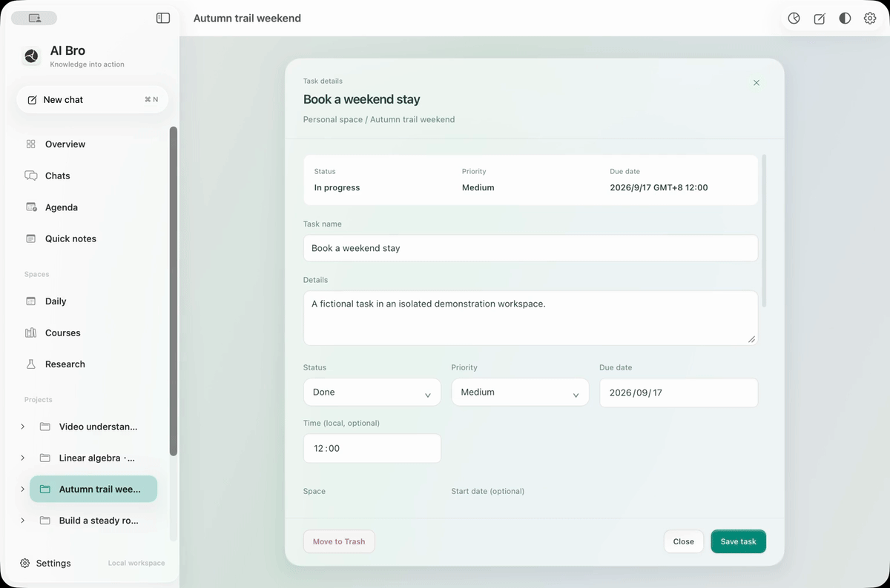

<p align="center"></p>
<h1 align="center">AI Bro</h1>
<p align="center"><strong>Turn a conversation into work you can continue.</strong></p>
<p align="center">Reviewable files. Durable projects. Ideas with a next step.</p>
<p align="center"><a href="README.md">简体中文</a> · English</p>
<p align="center"><a href="https://github.com/zihenghe04/AIBro/releases/tag/v0.7.1">Get the Mac app</a> · <a href="https://github.com/zihenghe04/AIBro/releases/download/v0.7.1/AI-Bro-0.1.3-unsigned.ipa">Get the iOS app</a> · <a href="https://zihenghe04.github.io/AIBro/?lang=en">Website</a> · <a href="https://zihenghe04.github.io/AIBro/?lang=en#film">Watch the demo</a> · <a href="CHANGELOG.md">Changelog</a></p>



AI Bro is a local-first AI workspace for Mac. Bring conversations, files, projects, research knowledge and schedules together. Start with a lecture, a paper or a passing thought; ask AI to help, inspect the sources and changes, and keep the result for your next session.

Native SwiftUI / AppKit navigation, charts and calendars sit alongside a resizable document reader. On macOS 26, the app uses system Liquid Glass. Daily, Courses and Research keep different kinds of work organized, with files and conversations attached to long-running projects.

## Built around your work

- **Learning:** organize slides and timetables, study alongside the source, and turn a review plan into scheduled tasks.
- **Research:** connect papers with methods, experiments and questions. Build a Wiki of evidence, failed attempts and review feedback.
- **Everyday projects:** capture an idea, shape it into a plan, and update existing tasks as the details change.

## Take AI Bro with you

**The iOS companion is available.** Capture on your phone and continue on your Mac, with research, coursework and everyday projects in context.

- **Your day at a glance:** tasks, events and imported ICS timetables.
- **Catch the idea:** save text, links, images and files, even offline; ask AI to help organize them later.
- **Keep knowledge close:** browse projects and your research Wiki, edit Markdown, and review AI changes as a diff before accepting them.
- **UCAS course assistant:** school sign-in, course lookup, attendance check-in and course QR codes.
- **Continue across devices:** connect both devices to the same self-hosted sync service for notes, tasks, projects and conversations, with explicit conflict handling.

[Download iOS 0.1.3 IPA](https://github.com/zihenghe04/AIBro/releases/download/v0.7.1/AI-Bro-0.1.3-unsigned.ipa) · [Installation and signing](mobile/docs/INSTALL.md) · [Connect your devices](mobile/docs/CONNECT_DEVICES.md) · [Mobile source](mobile/)

For iPhone and iPad running iOS 16 or later. The IPA requires signing with your own developer identity. The mobile interface is currently in Chinese; the English website describes its workflows without substituting Chinese screenshots.

### One less app before class

The UCAS course assistant brings the current class, the next class and attendance status together. Check in when you arrive, review the school’s response, open a dynamic course QR code, or add a class to your agenda. Foreground attendance and course reminders are optional.

[Explore the course assistant](https://zihenghe04.github.io/AIBro/?lang=en#ios-courses). The Chinese showcase uses fictional courses, teachers and simulated attendance states, with no personal records.

## Product features

The animation above is a recording of the English app with example data. Explore the [English workflow guide](https://zihenghe04.github.io/AIBro/?lang=en#workspace) or watch the task demonstration on the website.

### Files you can build on.

Keep the source beside the conversation. See what actually changed. Drop a file or @ reference it. Describe the change, inspect the diff, switch between source and preview, then save or undo.

### Keep the source beside the work.

Read a document without losing your place in the project. Move through sources and notes in the project tree while the reader stays alongside your work. Resize the panes to give the current task the room it needs.

### Projects that pick up where you left off.

Plans, tasks, conversations and outputs share one home. Organize work into a project. Use boards, dependencies and timelines to choose the next step, with project plans and daily logs available to future chats.

### Reading becomes research memory.

Keep the methods, failed attempts and unanswered questions—not just the papers. Browse a real Markdown directory inside Research. Connect concepts, methods, experiments and review feedback, follow sources and backlinks, then review proposed updates.

### Catch the thought. Make sense of it later.

An idea does not have to arrive fully organized. Write a line, add a link, image or file. Select a group later for AI organization, connections or a small experiment. Keep the original observations.

### Give the next step a time.

Keep classes, meetings and project tasks in view. Import an ICS timetable, open a date, and set recurrence and reminders. Review a proposed event from a capture or conversation before saving it.

### Keep a trail of the work.

The process matters as much as the answer. Return to a run’s goal, activity and results through execution history. Inspect and restore supported deleted items from the trash when something needs to come back.

### Change the model. Keep your workspace.

Choose the capabilities that fit the task. Connect a compatible custom API or local Codex sign-in, then select a model and reasoning effort per chat. Keep your projects, notes and files in the same place.

### Give the agent context to work with

- **Source-linked retrieval:** local BM25 indexing, optional vector retrieval and reranking, with chapter and neighboring-passage reads.
- **Inspectable execution:** activity records for file tools, search, page reads, terminal commands and research agents; review key operations in the approval bar.
- **Reusable workflows:** Skills for repeated work, with project plans, long-term memory and daily logs available to later chats and scheduled jobs.
- **Organized conversations:** project chats stay with the project. Use folders, renaming, moving, archiving and recovery for other conversations.

## Get started

1. Download the Mac app from [GitHub Releases](https://github.com/zihenghe04/AIBro/releases/tag/v0.7.1) and follow the [installation guide](docs/DISTRIBUTION.md).
2. Connect a compatible API or local official Codex CLI sign-in, then select a model.
3. Drop in a file, paste a link or `@` reference saved material. Describe the result you want.
4. Inspect the source, preview and changes in the reader. Keep the notes, files and next steps in a project.

> Try: “Summarize this paper’s method and experiments, keep the evidence links, and write a research note with questions worth testing.”

## Saved locally. Connected by choice.

Projects, chats, notes and managed files are stored on your Mac. Choose your model provider and authorized folders, or deploy your own sync service to continue across personal devices. When using a remote model, the relevant request content is sent to your configured provider.

## Development and documentation

```sh
git clone https://github.com/zihenghe04/AIBro.git
cd AIBro
npm ci
python3 -m venv .venv
. .venv/bin/activate
python -m pip install -r requirements.txt
npm run start:native
```

See [installation and building](docs/DISTRIBUTION.md) for toolchain requirements and release verification.

[Changelog](CHANGELOG.md) · [Desktop and data](docs/DESKTOP_APP.md) · [Retrieval](docs/KNOWLEDGE_RETRIEVAL.md) · [Self-hosted sync](docs/CLOUD_SYNC.md) · [Contributing](CONTRIBUTING.md)

Licensed under [AGPL-3.0](LICENSE). Third-party dependencies retain their licenses. User files, notes and credentials are not part of the application source distribution.

### Keep plans on time

Give a task a deadline and choose when to be reminded: at the deadline, 15 minutes, an hour, or a day before. Completing or rescheduling it updates pending notifications. Enable notifications in Agenda → Reminders on Mac, or Settings → Reminders on iOS. Task reminder settings sync between devices; each device manages its own notification permission.
