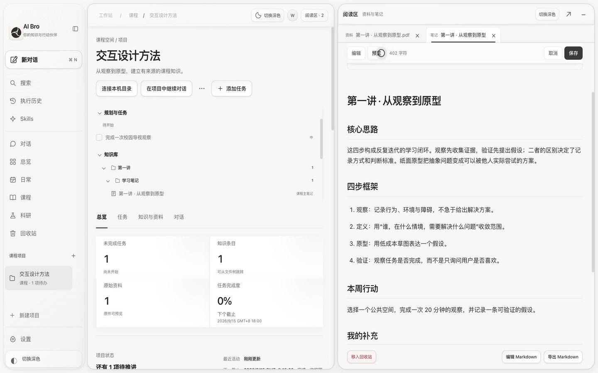
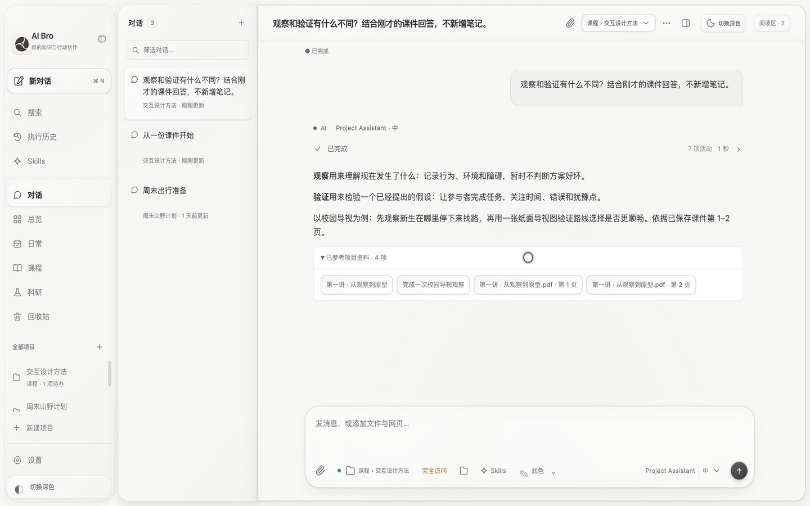
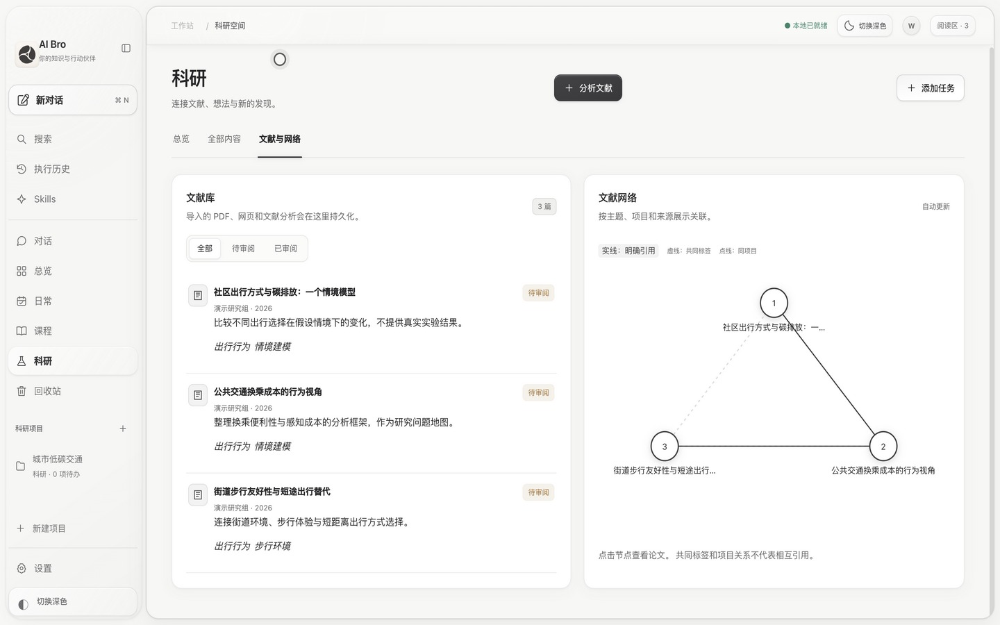
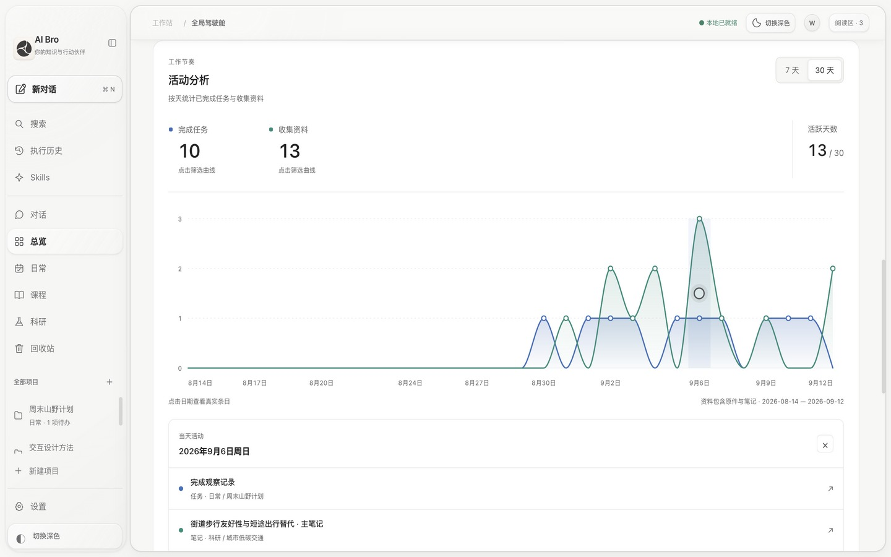

<p align="center"></p>
<h1 align="center">AI Bro</h1>
<p align="center"><strong>你的知识与行动伙伴</strong></p>
<p align="center">把持续对话、原始资料、自己的理解和下一步，放在同一个工作区。</p>
<p align="center">简体中文 · <a href="README.en.md">English</a></p>
<p align="center"><a href="https://github.com/zihenghe04/ai-bro-app/releases">下载 Mac App</a> · <a href="https://zihenghe04.github.io/ai-bro-app/">产品与短片</a> · <a href="#快速开始">快速开始</a> · <a href="CONTRIBUTING.md">参与改进</a></p>



AI 帮你读完一份课件或论文之后，工作可以继续。AI Bro 将原件、可编辑 Markdown 笔记、任务与项目关联保存；换个对话，也能检索已有知识，从来源继续核对。

> 首个公开 App Release 正在准备，当前可从源码运行。二进制下载开放后会在这里更新。

**当前为 macOS 开发预览版。**发行包支持 Apple Silicon、macOS 12+；使用 ad-hoc 签名，尚未完成 Apple Developer ID 签名与公证，不含自动更新。许可证仍在确认中，当前不宣称采用某项开源许可。

[观看中文产品短片](https://zihenghe04.github.io/ai-bro-app/assets/film-zh.mp4) · [Watch in English](https://zihenghe04.github.io/ai-bro-app/assets/film-en.mp4)

截图与短片来自隔离的示例工作区，不含个人资料。短片使用预设模型回复，展示真实应用操作和保存过程，经过剪辑。

## 从资料到下一步

> 把这份课件整理进课程项目，保留原件，生成主笔记和合理的学习任务。

1. **交给 AI**：拖入文件或粘贴链接，说明需求，查看读取与执行进度。
2. **核对成果**：打开对应的项目、原件、主笔记与任务，检查内容和归属。
3. **留下理解**：并排阅读原件和笔记，编辑 Markdown，保存自己的补充。
4. **接着工作**：新对话检索已有资料；后续补充截止时间时，更新原任务。

直接拖入项目的文件会先保存为「待 AI 分析」。存储、改名和文字索引不会被当成已经分析；AI 对人工编辑笔记的修改会先形成待核对草稿。

## 能做什么

| 能力 | 可以怎样用 |
| --- | --- |
| **持续对话与资料整理** | 文件与指令一起发送；结合上下文判断空间和项目，课程归属不明确时先核对。 |
| **持久化知识库** | 原件、笔记、任务与来源关联保存；按项目检索，跨会话继续使用。 |
| **可编辑主笔记** | 标签式阅读区、PDF 页码导航、Markdown 编辑与导出；相关笔记可合并，保留人工内容与历史版本。 |
| **论文与研究** | 论文结构化分析，按 DOI、arXiv 或链接去重更新；关系网络区分明确引用、共同标签和项目关系。 |
| **任务与进度** | 新增、更新、完成和移动任务，维护截止时间与清单；D3 趋势图支持 7/30 天切换、选日查看条目。 |
| **模型与 Skills** | 本机官方 Codex 登录或兼容 API；按对话选择模型与推理强度，复用内置/自定义 Skills，单独配置润色模型。 |
| **本机项目关联** | 在授权目录中按线索发现项目，只读查看并保存目录关联，下一次对话可以读取最新资料。 |
| **可选自托管同步** | 将支持的知识、任务、对话和受管原件同步到自己的服务器，查看状态并处理冲突。 |

界面支持中文／English、深浅外观、可调宽度分区、可跳过或重播的新手引导。macOS 26 可使用原生系统玻璃；其他环境保留可读的回退外观，详见[外观与可访问性](docs/APPEARANCE.md)。

<details>
<summary>查看更多实际界面：知识问答、论文与进度</summary>

**换个对话，检索已保存的知识。**



**论文库与关系网络。**



**从趋势回到具体任务与资料。**



</details>

## 快速开始

### 方式一：下载 App

1. 从 [Releases](https://github.com/zihenghe04/ai-bro-app/releases) 下载 `AI-Bro-<version>-macos-arm64-preview.zip` 与对应校验文件。
2. 核对校验值，解压并将 `AI Bro.app` 移到「应用程序」。更新前正常退出旧版 App；工作区会保留。
3. 打开「设置」连接模型，再从新手引导或一份示例资料开始。

发行包内置 Python 与 PDF 运行时，**运行 App 不需要另外安装 Node.js、Python 或 Homebrew**。首次打开可能需要在 macOS「隐私与安全性」中允许该预览 App；完整步骤见[安装与构建](docs/DISTRIBUTION.md)。Intel、Windows、Linux 发行包暂未提供。

### 方式二：从源码运行

需要 macOS、Node.js 22+（发行构建推荐 24）、Python 3.10+。PDF 预览与图表提取使用 PyMuPDF。

```sh
git clone https://github.com/zihenghe04/ai-bro-app.git
cd ai-bro-app
npm ci
python3 -m venv .venv
source .venv/bin/activate
python -m pip install -r requirements.txt
AI_WORKSTATION_PYTHON="$PWD/.venv/bin/python" npm start
```

源码启动默认使用本机工作区；已经安装 App 时，先退出旧实例。开发测试请按[贡献指南](CONTRIBUTING.md)使用隔离数据。

```sh
# 本机开发 App，仍依赖本机 Python
npm run app

# 含独立运行时的发行包；输出目录必须尚不存在
npm run release:mac -- --output "$PWD/release/preview"
```

### 连接模型

- **兼容 API**：在设置中填写服务地址、模型与 API Key，点击「保存设置」。测试成功不等于凭据已经保存。
- **账号登录**：需要额外安装官方 Codex CLI，发行包不内置它。可选模型、推理强度、文件和工具能力取决于当前连接。
- 模型调用可能产生提供商费用。AI Bro 不提供无限上下文、免费额度或服务可用性保证。

## 数据、权限与当前边界

- **本地优先**：SQLite 保存规范数据，JSON 是可读镜像。使用模型时，相关内容会发给所选提供商；获取网页也需要访问对应来源。
- **凭据留在本机**：桌面 API Key 使用系统加密保存，不进入工作区快照与云同步。浏览器凭据与桌面独立配置；macOS 可能请求钥匙串授权。
- **授权有范围**：本机项目能力是目录发现、只读查看与持久关联，当前不支持任意源码写入或终端命令执行。会话审批模式不会扩大这些能力。
- **长文件有边界**：原件、页面图像或文字的投递方式取决于连接；文件大小、图片预算和模型上下文仍有限制。
- **同步不等于备份**：自托管首版会同步支持的修改和删除，不提供端到端加密、按项目选择同步或实时多人协作；模型密钥和本机目录授权不随工作区同步。

旧版 AI Workstation 的工作区与内部应用标识会保留。数据目录、备份、恢复与删除语义见[桌面文档](DESKTOP_APP.md)；同步范围、设备撤销和服务器明文边界见[云同步说明](CLOUD_SYNC.md)。

## 文档与开发

| 文档 | 内容 |
| --- | --- |
| [安装与构建](docs/DISTRIBUTION.md) | 下载、首次打开、构建、版本与校验 |
| [桌面使用](DESKTOP_APP.md) | 数据目录、模型设置、备份与恢复 |
| [自托管同步](CLOUD_SYNC.md) / [服务部署](cloud/README.md) | 同步范围、冲突、账号与运维 |
| [外观与可访问性](docs/APPEARANCE.md) | 主题、系统玻璃、回退与开发细节 |
| [版本说明](docs/RELEASE_NOTES.md) | 已发布改动与当前限制 |
| [贡献指南](CONTRIBUTING.md) | 开发环境、测试、问题反馈与 PR |

在已激活的 Python 虚拟环境中运行：

```sh
npm test
npm run test:cloud
```

后端测试入口为每组测试创建独立临时工作区，不需要真实资料或模型密钥。`asset-manifest.json` 是 Web、服务端与桌面构建的共同资源入口。

项目许可证尚未确定；第三方依赖保留各自许可证，相关说明见[发行文档](docs/DISTRIBUTION.md#依赖与源码--dependencies-and-source)。Logo 的设计来源见[品牌文档](BRAND.md)。
