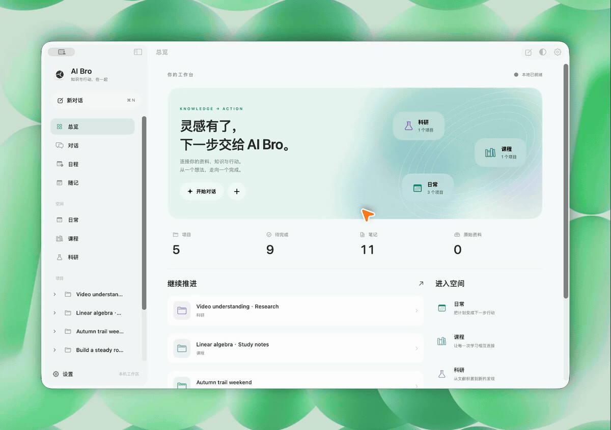
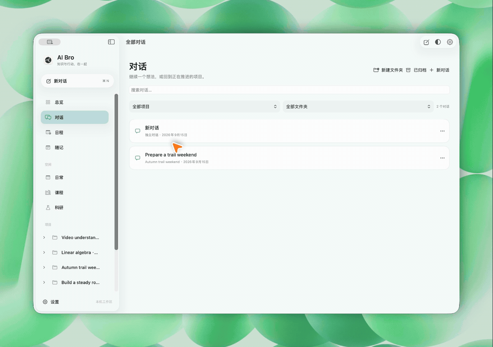
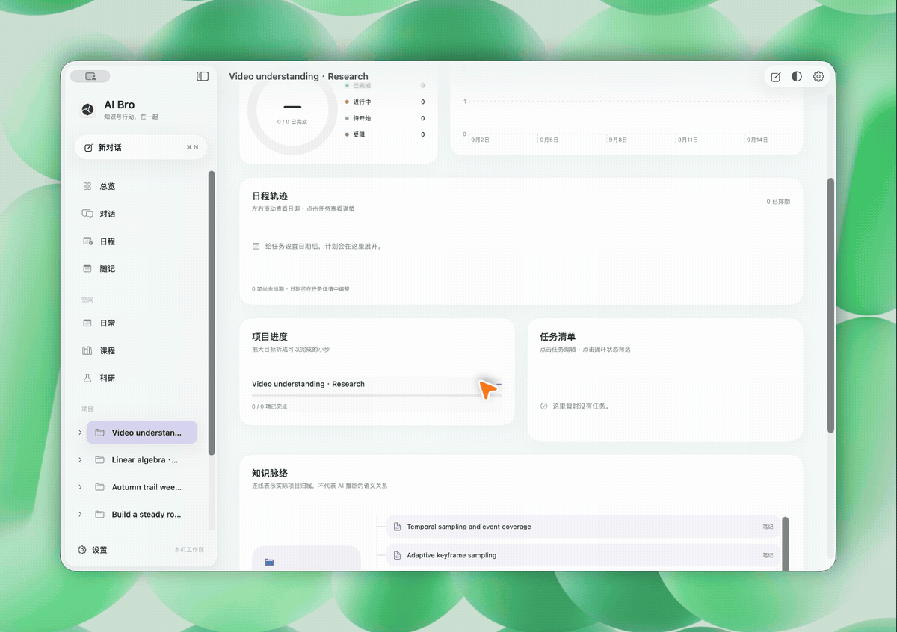
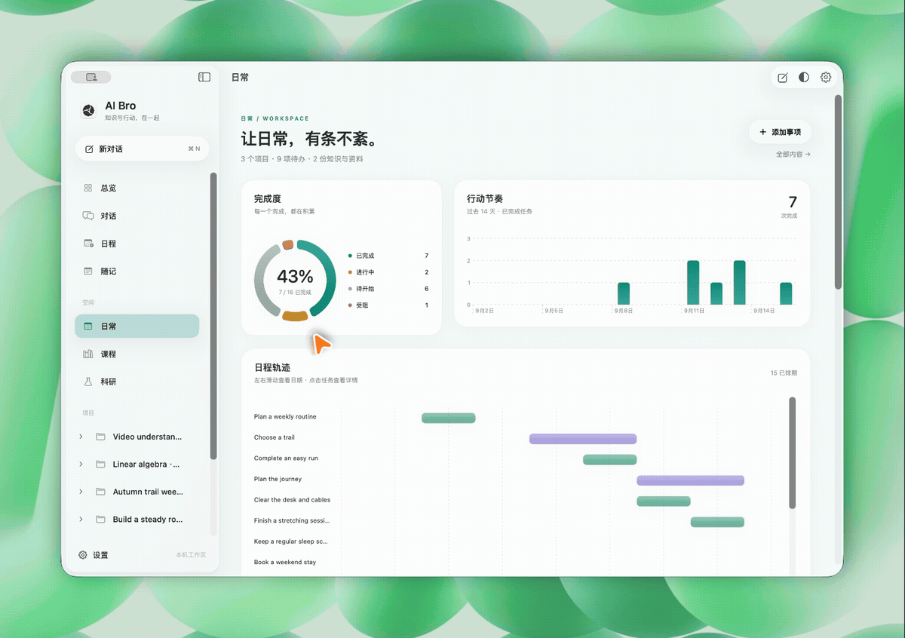
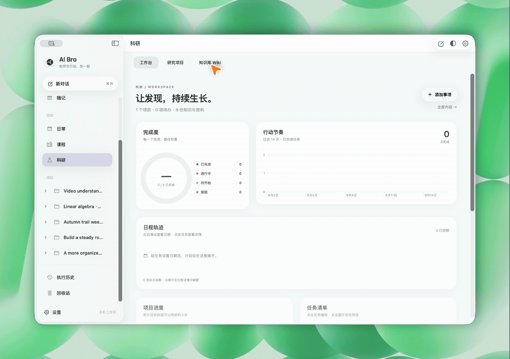
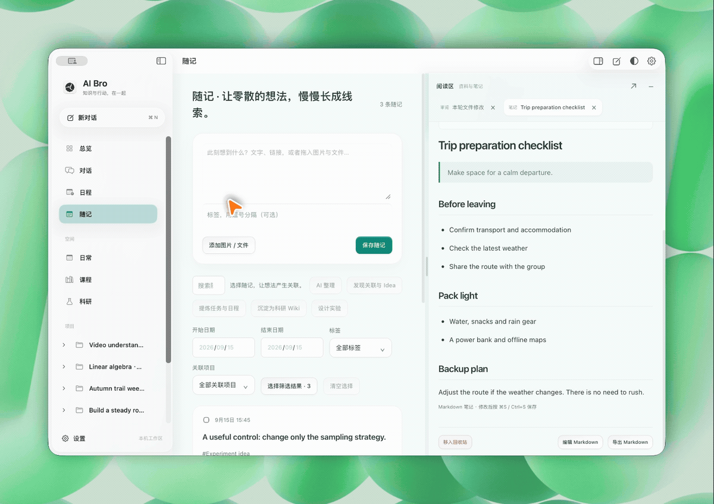
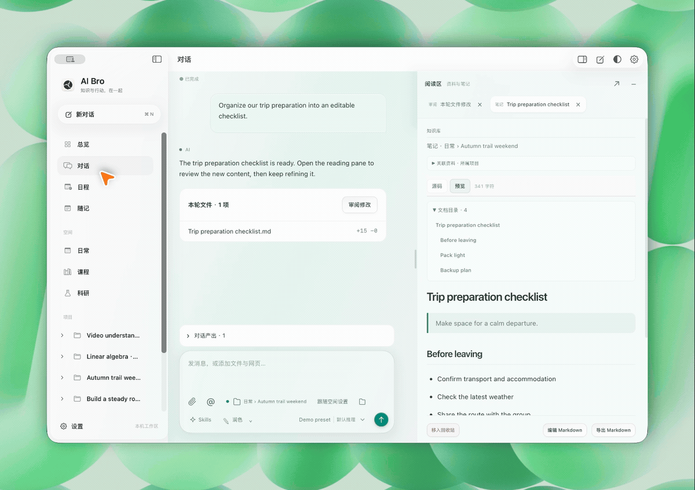
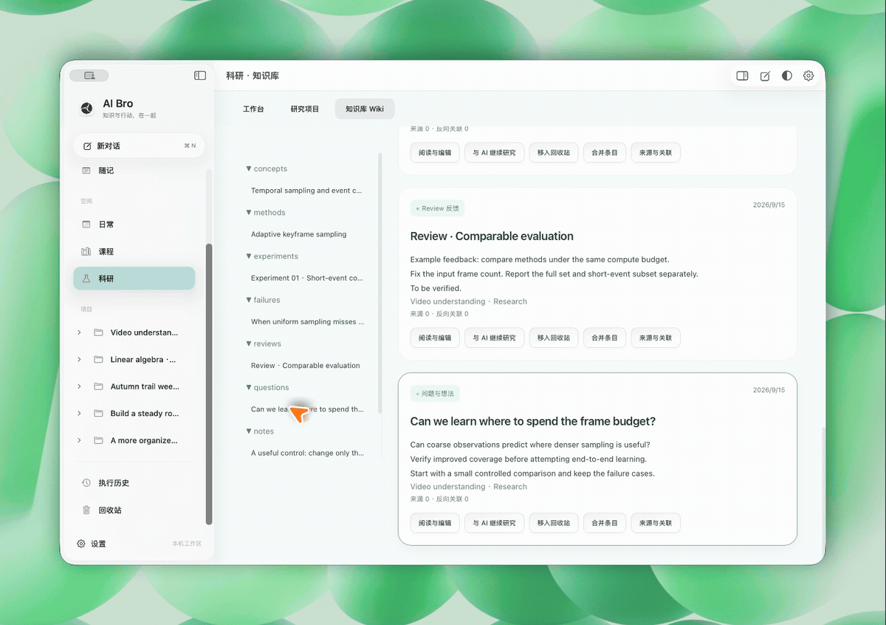
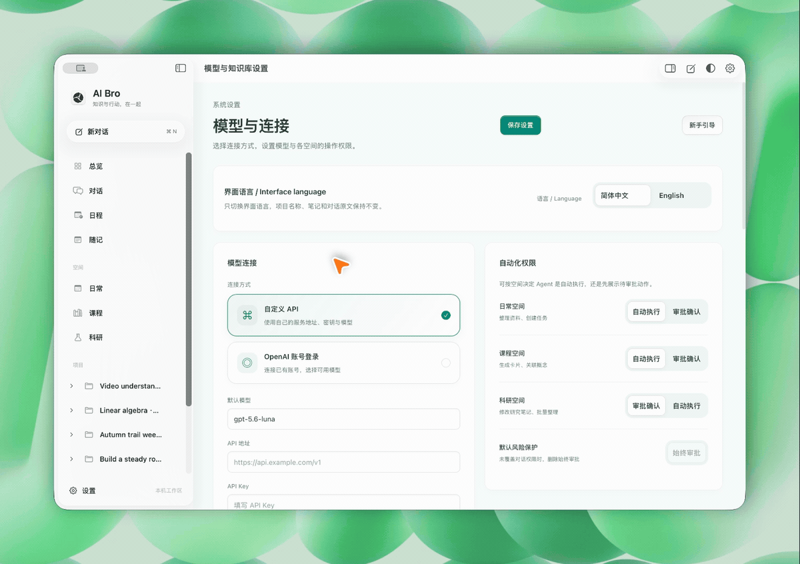

<p align="center"></p>
<h1 align="center">AI Bro</h1>
<p align="center"><strong>把一次对话，变成可以继续的工作。</strong></p>
<p align="center">文件有版本，项目有记忆，想法有下一步。</p>
<p align="center">简体中文 · <a href="README.en.md">English</a></p>
<p align="center"><a href="https://github.com/zihenghe04/AIBro/releases/tag/v0.7.0">下载 Mac App</a> · <a href="https://zihenghe04.github.io/AIBro/">官网</a> · <a href="https://zihenghe04.github.io/AIBro/#workspace">功能演示</a> · <a href="CHANGELOG.md">更新日志</a></p>



AI Bro 是一个本地优先的 Mac AI 工作区，把对话、文件、项目、科研知识与日程放在同一个地方。你可以带入一份课件、一篇论文或一个想法，让 AI 整理与推进，在旁边核对来源和修改，再把成果留给下一次工作。

原生 SwiftUI / AppKit 导航、图表与日程，配合可调节的文档阅读区；macOS 26 上使用系统 Liquid Glass。日常、课程、科研各有空间，资料与对话可以归入长期项目。

## 一份资料，可以接着做什么？

- **学习**：导入课件和课表，整理知识脉络，边看原件边补充笔记，把复习安排放进日程。
- **科研**：从论文进入方法、实验和问题，把来源、失败经验与 review 反馈沉淀进 Wiki，带着积累继续研究。
- **日常与项目**：随手记下想法，整理成计划、清单和日程；在后续对话里修改已有安排，而不是重新创建一遍。

## 产品特色

下面的 GIF 来自真实应用操作，使用示例工作区。官网提供自动循环的轻量视频与放大查看，完整演示见[产品影片](https://zihenghe04.github.io/AIBro/#film)。

### 文件有了下文。

把原件放在对话旁边，修改就不再是一段难以核对的回答。 拖放或 @ 引用资料，说清想改哪里。AI 生成修改后，逐项查看 Diff，在源码与排版预览间切换，再保存或撤销。



### 文件在左，思考在旁。

看资料的时候，不必丢掉项目的上下文。 在项目文件树中切换原件和笔记，阅读区保持在右侧。并排核对资料，调节分区宽度，让阅读和推进工作发生在同一个地方。



### 项目，接着上次继续。

计划、任务、对话和产出，终于在同一处。 把工作归入项目。通过看板、依赖和时间轴安排下一步；项目计划与按日日志为后续对话提供持续上下文。



### 读过的，成为研究积累。

论文之外，留下方法、失败经验和仍然开放的问题。 科研空间里浏览真实 Markdown 目录。连接概念、方法、实验和 review 反馈，沿来源与双链核对证据，审阅后再合并更新。



### 先记下来，再长出新想法。

零散灵感，不必马上整理得井井有条。 随手写一句，附上链接、图片或文件。积累后按主题选中一组，让 AI 整理、寻找关联或设计验证步骤，原始记录始终保留。



### 让下一步，真正落到时间里。

课表、会议和任务安排，不用在几个工具间来回记。 导入 ICS 课表，点击日期查看详情。设置循环和提前提醒；从随记或对话提出日程时，先检查草稿再保存。



### 做过什么，找得回来。

结果之外，过程也值得留下。 从执行历史回看一次工作的目标、活动和结果。误删的受管内容可以在回收站检查、恢复，让整理工作更从容。



### 模型由你选，工作留在这里。

换一种能力，不用换掉整个工作区。 连接自定义 API 或本机 Codex 登录，按会话选择模型与推理强度。文件、笔记和项目保持归属，继续用适合当前任务的模型推进。



### 让 Agent 带着上下文推进

- **检索有来源**：本地 BM25 关键词索引、可选向量检索与重排；按章节和相邻段落继续阅读，答案可以回到证据。
- **执行有过程**：文件工具、联网搜索、网页读取、终端命令与研究子代理统一记录活动，关键操作通过审批条确认。
- **工作流可复用**：用 Skills 组织常用流程；项目保存计划、长期记忆和按日日志，为后续对话与自动任务提供上下文。
- **对话有归属**：项目会话留在项目下，其他对话用文件夹整理，支持重命名、移动、归档与恢复。

## 开始使用

1. 从 [GitHub Release](https://github.com/zihenghe04/AIBro/releases/tag/v0.7.0) 下载 Mac App，按[安装指南](docs/DISTRIBUTION.md)完成安装。
2. 在设置中连接兼容 API，或使用本机官方 Codex CLI 登录；选择这次对话要使用的模型。
3. 拖入文件、粘贴链接或用 `@` 引用资料，告诉 AI 你想得到的结果。
4. 在阅读区检查原件、预览和修改，把资料、笔记与下一步任务归入项目。

> 可以这样开始：“整理这篇论文的方法与实验，保留证据来源，把值得验证的问题写成研究笔记。”

## 本地保存，按需连接

项目、对话、笔记和受管文件保存在本机。你决定连接哪个模型、授权哪个目录，也可以部署自己的同步服务，在个人设备间继续工作。使用远程模型时，完成请求所需的内容会发送至你配置的提供商。

## 开发与文档

```sh
git clone https://github.com/zihenghe04/AIBro.git
cd AIBro
npm ci
python3 -m venv .venv
. .venv/bin/activate
python -m pip install -r requirements.txt
npm run start:native
```

构建环境、校验和与安装步骤见[安装与构建](docs/DISTRIBUTION.md)。

[更新日志](CHANGELOG.md) · [桌面与数据](docs/DESKTOP_APP.md) · [检索设计](docs/KNOWLEDGE_RETRIEVAL.md) · [自托管同步](docs/CLOUD_SYNC.md) · [贡献指南](CONTRIBUTING.md)

AI Bro 采用 [AGPL-3.0](LICENSE) 许可。第三方依赖保留各自许可；用户的文件、笔记和凭据不属于应用源码分发范围。
